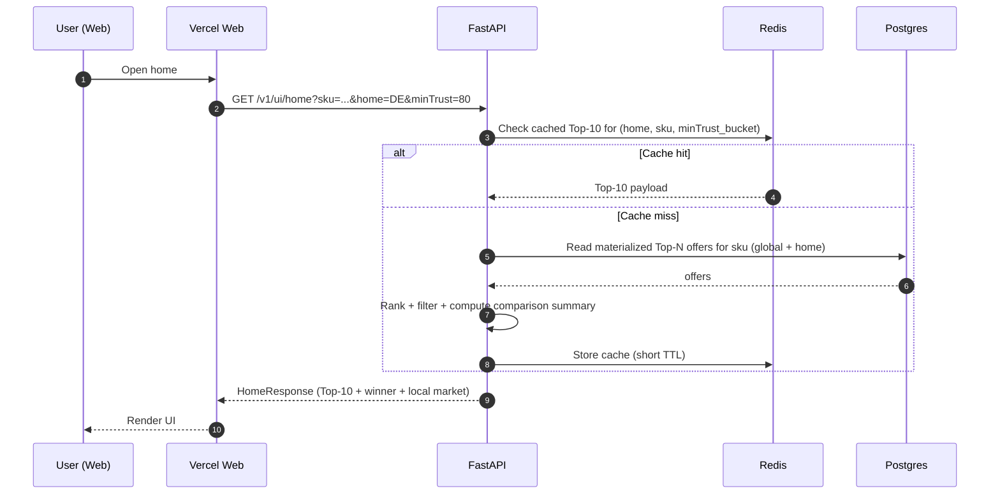
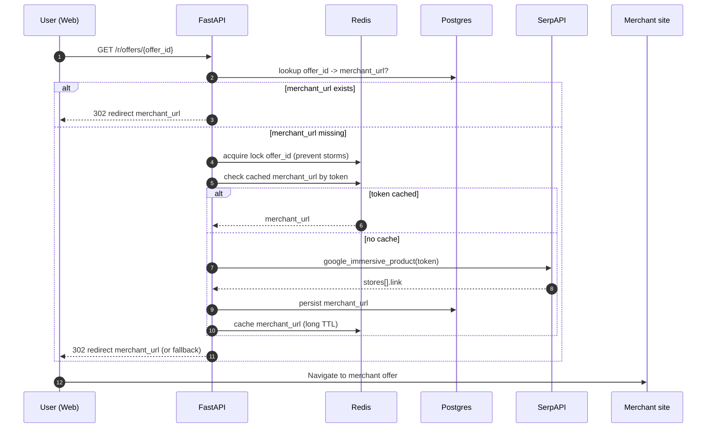

# System architecture

## High-level components

1. **Frontend (Vercel)**
   - Home screen (Top‑10 + Compare + Risk slider)
   - Deal cards (expand for guides + alerts)
   - CTA redirects through backend (never store raw merchant links on the client)

2. **Backend API (FastAPI on Railway)**
   - serves UI-specific endpoints
   - computes comparison values
   - provides redirect endpoint with lazy hydration
   - enforces rate limits and caching

3. **Data layer**
   - Postgres: normalized entities (SKU, offers, merchants, prices, country facts, guide versions)
   - Redis: caching + locks (SerpAPI responses, hydration results, redirect cache)

4. **Ingestion & ranking pipeline**
   - fetch: SerpAPI `google_shopping`
   - normalize & dedup: match to Golden SKU(s)
   - rank: compute effective price and choose Top‑10
   - enrich: selective `google_immersive_product` (Top‑N or on-click)

5. **Guides pipeline (LLM + whitelist sources)**
   - crawl/refresh country sources on schedule
   - extract facts to structured JSON with citations
   - compose UI steps (3–7) + alerts
   - publish to `country_guides` table

## Request flows

### A) Home screen load

### B) CTA “Claim Arbitrage” (lazy hydration)

## Modules (backend)

- `api.routes.ui`: UI bootstrap endpoints
- `api.routes.redirect`: redirect + lazy hydration
- `services.serpapi`: SerpAPI clients and request budgeting
- `services.normalize`: attribute extraction, golden SKU matching
- `services.rank`: effective price, trust weighting, Top‑10 selection
- `services.guides`: country facts retrieval + LLM composition
- `stores.postgres`: repositories / ORM models
- `stores.redis`: cache + locks + TTL policy
- `workers.refresh`: scheduled refresh jobs (prices + guides)
